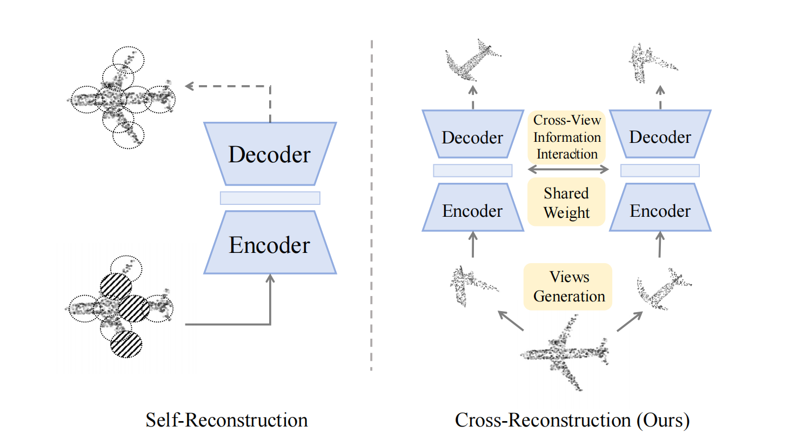
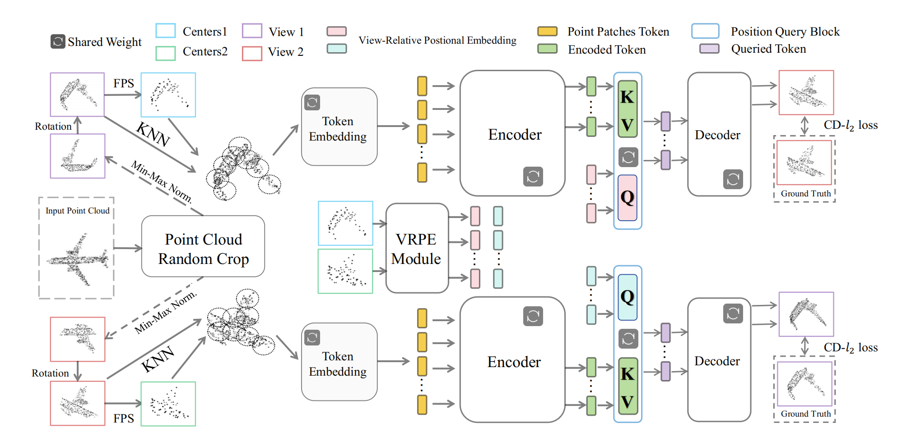
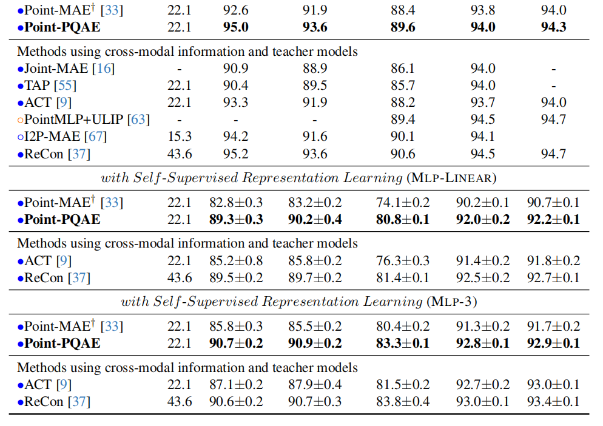

# Point-PQAE (ICCV 2025)

> [**Towards More Diverse and Challenging Pre-training for Point Cloud Learning: Self-Supervised Cross Reconstruction with Decoupled Views**](https://arxiv.org/abs/2509.01250)

> [Xiangdong Zhang](https://scholar.google.com/citations?user=5S-TKKoAAAAJ&hl=zh-CN&oi=sra)\*, [Shaofeng Zhang](https://scholar.google.com/citations?user=VoVVJIgAAAAJ&hl=zh-CN&oi=sra)\* and [Junchi Yan](https://scholar.google.com/citations?user=ga230VoAAAAJ&hl=zh-CN&oi=sra) <br> 

> Point-PQAE: Self-Supervised Cross Reconstruction with Decoupled Views for Point Cloud Learning

TL;DR: We introduce a **cross-reconstruction** method Point-PQAE, **a new learning paradigm for point cloud self-supervised learning**. By reconstructing one decoupled view from another, it creates a more challenging task than Point-MAE's **self-reconstruction**, leading to significantly better performance.

<div  align="center">    
 
 <p>Figure 1: Comparison between <strong>cross-reconstruction (ours)</strong> and self-reconstruction.</p>
</div>

## 📰 News

</h2>
<h5 align="center"> If you find our project helpful, please give us a star ⭐ on GitHub for the latest update.  </h2>

- 🎉 Sept, 2024: Our previous work [PCP-MAE](https://arxiv.org/abs/2408.08753) is accepted by **NeurIPS 2024 as Spotlight**, check out the [code]()
- 🎉 Jun, 2025: Point-PQAE is accepted by **ICCV 2025**.
- 💥 Sept, 2025: The [Point-PQAE Paper](https://arxiv.org/abs/2509.01250) is now available in arxiv.
- 📌 Sept, 2025: The pytorch implementation of Point-PQAE has been released.

## ✅ TODO List
- [x] Release the training and inference code.
- [x] Release the checkpoints.

## Introduction

Point-PQAE introduces a more challenging and effective pre-training paradigm for 3D point cloud learning. **While most self-supervised methods focus on reconstructing masked parts of a single point cloud view, we propose a more difficult and informative pre-training task called cross-reconstruction.**

<div  align="center">    
 
 <p>Figure 1: Overview of Point-PQAE.</p>
</div>

The model is then tasked with reconstructing one view given another view, which encourages the learning of more robust and meaningful representations by understanding both intra-view and inter-view relationships. To achieve this, we designed three novel modules 1) decoupled views generation, 2) VRPE generation, and 3) positional query block. To our knowledge, **we are the first to design and apply** crop mechanism to point cloud self-supervised learning.

<div  align="center">    
 
 <p>Figure 2: Performance on ScanObjectNN.</p>
</div>

Point-PQAE surpasses previous single-modal self-reconstruction methods on challenging benchmarks. For instance, it outperforms the Point-MAE baseline by 6.5%, 7.0%, and 6.7% on three variants of the ScanObjectNN dataset, demonstrating the superior quality of the learned representations.

## Point-PQAE Models

| Task              | Dataset        | Config                                                               | Acc.       | Checkpoints                                                                                     |
|-------------------|----------------|----------------------------------------------------------------------|------------|----------------------------------------------------------------------------------------------------------|
| Pre-training      | ShapeNet       | [base.yaml](cfgs/pretrain/base.yaml)                        | N.A.       | [Pre-train](https://drive.google.com/drive/folders/15Vz4JlHun2vK8_Q7VaGrTJgBfe5JMHLv?usp=sharing)           |
| Classification    | ScanObjectNN   | [finetune_scan_objbg.yaml](./cfgs/full/finetune_scan_objbg.yaml)     | 95.0%     | -          |
| Classification    | ScanObjectNN   | [finetune_scan_objonly.yaml](./cfgs/full/finetune_scan_objonly.yaml) | 93.6%     | -        |
| Classification    | ScanObjectNN   | [finetune_scan_hardest.yaml](./cfgs/full/finetune_scan_hardest.yaml) | 89.6%     | -       |
| Classification    | ModelNet40(1k) | [finetune_modelnet.yaml](./cfgs/full/finetune_modelnet.yaml)         | 94.0%      | -     |
| Classification    | ModelNet40(8k) | [finetune_modelnet.yaml](./cfgs/full/finetune_modelnet.yaml)         | 94.3%      | -     |
| Part Segmentation | ShapeNetPart   | [segmentation](./segmentation)                                       | 84.6% Cls.mIoU | -        |
| Scene Segmentation | S3DIS   | [semantic_segmentataion](./semantic_segmentation)                                       | 61.4% mIoU | -        |

| Task              | Dataset    | Config                                   | 5w10s (%)  | 5w20s (%)  | 10w10s (%) | 10w20s (%) |                                                                      |
|-------------------|------------|------------------------------------------|------------|------------|------------|------------|------------------------------------------------------------------------------------------------|
| Few-shot learning | ModelNet40 | [fewshot.yaml](./cfgs/full/fewshot.yaml) | 96.9±3.2 | 98.9±1.0 | 94.1±4.2 | 96.3±2.7 |


To fully reproduce our reported results, we recommend fine-tuning the pre-trained ckpt-300 with different random seeds (typically 8 different seeds) and recording the best performance which is also adopted by other peer methods (e.g. [Point-MAE](https://github.com/Pang-Yatian/Point-MAE), [ReCon](https://github.com/qizekun/ReCon) and [PCP-MAE](https://github.com/aHapBean/PCP-MAE)).

## Requirements
PyTorch >= 1.7.0 < 1.11.0;
python >= 3.7;
CUDA >= 9.0;
GCC >= 4.9;
torchvision;

```
# Quick Start
conda create -n pcpmae python=3.10 -y
conda activate pcpmae

# Install pytorch
conda install pytorch==2.0.1 torchvision==0.15.2 cudatoolkit=11.8 -c pytorch -c nvidia
# pip install torch==2.0.1+cu118 torchvision==0.15.2+cu118 -f https://download.pytorch.org/whl/torch_stable.html

# Install required packages
pip install -r requirements.txt
```

```
# Install the extensions
# Chamfer Distance & emd
cd ./extensions/chamfer_dist
python setup.py install --user
cd ./extensions/emd
python setup.py install --user
# PointNet++
pip install "git+https://github.com/erikwijmans/Pointnet2_PyTorch.git#egg=pointnet2_ops&subdirectory=pointnet2_ops_lib"
```

## Datasets

We use ShapeNet, ScanObjectNN, ModelNet40, ShapeNetPart and S3DIS in this work. See [DATASET.md](./DATASET.md) for details.

## Training/Inference Scripts

### Pre-training

```
CUDA_VISIBLE_DEVICES=<GPU> python main.py --config cfgs/pretrain/base.yaml --exp_name <output_file_name>

# For example
CUDA_VISIBLE_DEVICES=0 python main.py --config cfgs/pretrain/base.yaml --exp_name Point-PQAE
```
### Fine-tuning

Fine-tuning on ScanObjectNN:
```
# Select one config from finetune_scan_objbg/objonly/hardest.yaml

# Full
python main.py --config cfgs/full/finetune_scan_hardest.yaml \
--finetune_model --exp_name <output_file_name> --ckpts <path_to_pretrained_model> --model-prefix PQAE_encoder --seed $RANDOM

# Linear
python main.py --config cfgs/linear/finetune_scan_hardest.yaml \
--finetune_model --exp_name <output_file_name> --ckpts <path_to_pretrained_model> --model-prefix PQAE_encoder --seed $RANDOM

# MLP-3
python main.py --config cfgs/mlp3/finetune_scan_hardest.yaml \
--finetune_model --exp_name <output_file_name> --ckpts <path_to_pretrained_model> --model-prefix PQAE_encoder --seed $RANDOM
```

ModelNet40:
```
# full/linear/mlp3
# 1K points
python main.py --config cfgs/full/finetune_modelnet.yaml \
--finetune_model --exp_name <output_file_name> --ckpts <path_to_pretrained_model> --seed $RANDOM

# 8K points
python main.py --config cfgs/full/finetune_modelnet_8k.yaml \
--finetune_model --exp_name <output_file_name> --ckpts <path_to_pretrained_model> --seed $RANDOM
```

Few-shot learning:

```
# full/linear/mlp3
python main.py --config cfgs/full/fewshot.yaml \
--finetune_model --exp_name <output_file_name> --ckpts <path_to_pretrained_model> --way <5 or 10> --shot <10 or 20> --fold <0-9> --seed $RANDOM
```

Part segmentation on ShapeNetPart:
```
cd segmentation
python main.py --gpu <gpu_id> --ckpts <path_to_pretrained_model> \
--log_dir <log_dir> --learning_rate 0.0002 --epoch 300 \
--root <your_data_path>/data/shapenetcore_partanno_segmentation_benchmark_v0_normal/ \
--seed $RANDOM --model-prefix PQAE_encoder
```

Semantic segmentation on S3DIS:

```
cd semantic_segmentation
python main.py --ckpts <path_to_pretrained_model> \
--root <your_data_path>/data/s3dis/stanford_indoor3d --learning_rate 0.0002 --epoch 60 --gpu <gpu_id>
```

## Contact

If you have any questions related to the code or the paper, feel free to email Xiangdong (`zhangxiangdong@sjtu.edu.cn`) or Shaofeng (`sherrylone@sjtu.edu.cn`).


## Acknowledgements

This codebase is built upon [Point-MAE](https://github.com/Pang-Yatian/Point-MAE), [ReCon](https://github.com/qizekun/ReCon), [Pointnet2_PyTorch](https://github.com/erikwijmans/Pointnet2_PyTorch).

## Citation

If you find our work useful in your research, please consider citing:

```bibtex
@misc{zhang2025diversechallengingpretrainingpoint,
      title={Towards More Diverse and Challenging Pre-training for Point Cloud Learning: Self-Supervised Cross Reconstruction with Decoupled Views}, 
      author={Xiangdong Zhang and Shaofeng Zhang and Junchi Yan},
      year={2025},
      eprint={2509.01250},
      archivePrefix={arXiv},
      primaryClass={cs.CV},
      url={https://arxiv.org/abs/2509.01250}, 
}
```